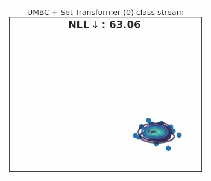

# Universal Mini-Batch Consistency for Set Encoding Functions

This is a code repository and demo of the paper "Universal Mini-Batch Consistency for Set Encoding Functions."

## Animated Streaming Examples

Sequentially updating the encoded vector of the Set Transformer leads to inconsistent and subpar prediction (left side
plots). After making the Set Transformer universally mini-batch consistent (right side plots) by adding the UMBC module
(UMBC + Set Transformer), the predictions can be updated sequentially so the set transformer can consistently handle
large or streaming sets without storing the full set in memory.

### Single Point Streaming

`single point stream` streams a single point at each timestep.

<span>
  
  
</span>

### Chunk Streaming

`chunk stream` streams chunks of 8 points at each timestep from a random permutation of set elements

<span>
  
  
</span>

### Class Streaming

`class stream` streams an entire class at each timestep

<span>
  
  
</span>

### One Each Class Streaming

`one each class stream` streams one point from each class at each timestep until there are no points left. If one class
has a stronger prior and more points, this leads to that cluster becoming dominant towards the end.

<span>
  
  
</span>

## Run MBC Tests

```make test```

## Downloading Datasets

### ModelNet40-2048 and ModelNet40-2048-C

ModelNet40-2048 and ModelNet40-2048-C can be downloaded from the following links which were acquired from the original
work which proposed the ModelNet40-C dataset
[Benchmarking and Analyzing Point Cloud Classification under Corruptions](https://github.com/jiawei-ren/ModelNet-C)

[ModelNet 2048](https://shapenet.cs.stanford.edu/media/modelnet40_ply_hdf5_2048.zip)

[ModelNet40-2048-C](https://zenodo.org/record/6017834#.Yoxry3VBzzM)

### ImageNet1k

ImageNet data can be acquired from [image-net.org](https://image-net.org/download.php)

## Training Models

```
cd [mvn,imgnet,modelnet]
PYTHONPATH=/path/to/umbc python runner.py
```

## Original Model Code

The base models we consider are all built from one of: [Deep Sets](https://github.com/manzilzaheer/DeepSets),
[Set Transformer](https://github.com/juho-lee/set_transformer), or
[Diff. EM (supplementary material)](https://openreview.net/forum?id=MXdFBmHT4C). Our code builds on the original
published code at the respective links.
